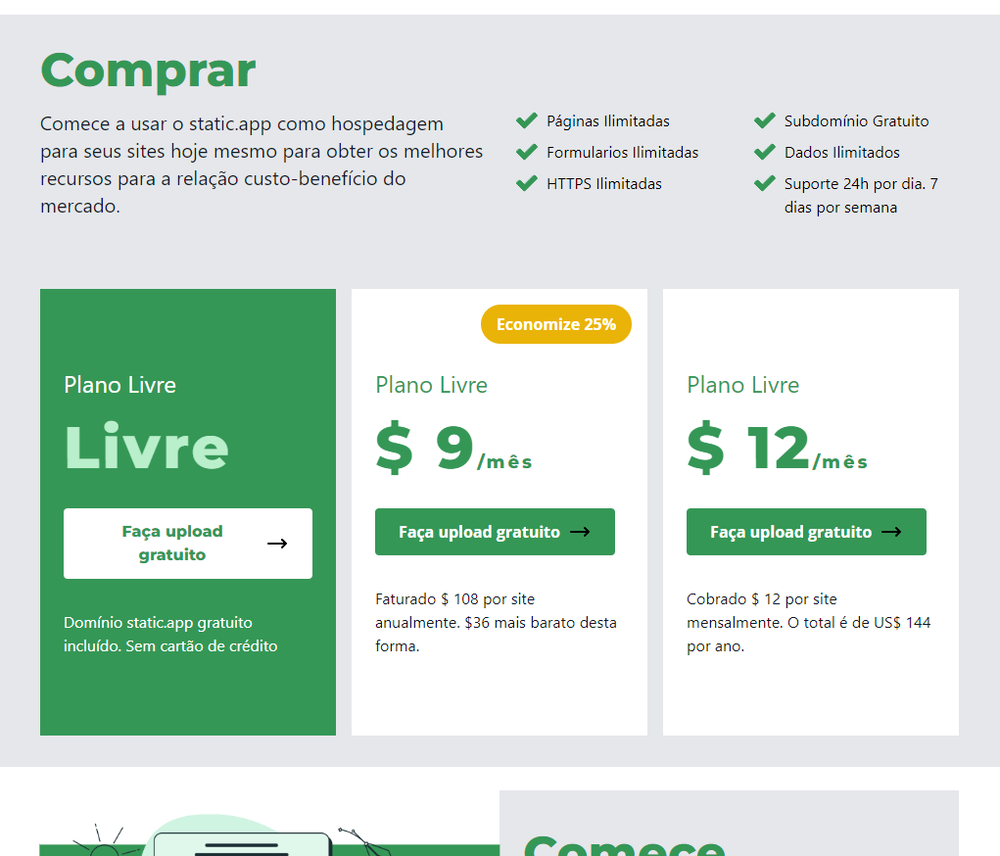

# Tailwindcss Website

## 📝 Sobre o Projeto

Este projeto se trata da recriação de um template, porém utilziando tailwindcss e react js para treinar estas tecnologias.

## ⚛️ Tecnologias Utilizadas

- React JS
- Tailwind CSS

## 💽 Como Rodar o Projeto

para baixar as dependências utilize `npm install`  
utilize o comando `npm start` para inicializar.

## 💻 Preview do Projeto

  
  
  
  
